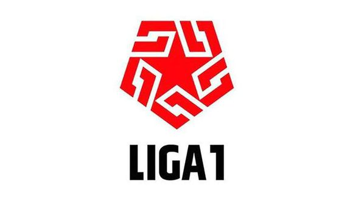
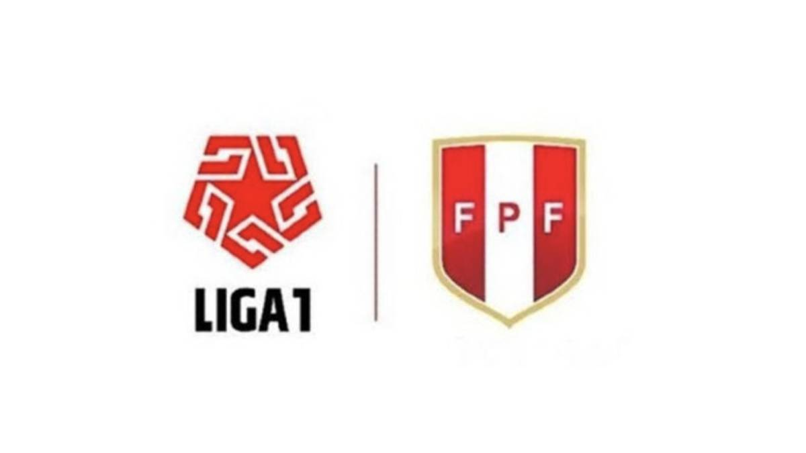

```{r setup, include=FALSE}
library(tint)
# invalidate cache when the package version changes
knitr::opts_chunk$set(tidy = FALSE, cache.extra = packageVersion('tint'))
options(htmltools.dir.version = FALSE)
setwd("D:/ECONOMÍA UNFV/IEL/TrabajoFinalBEST")
```

```{r fig-nocap-margin-first, fig.margin=TRUE, fig.width=1, fig.height=1, cache=TRUE, echo=FALSE}


```
# Liga de futbol Nacional

 
La [Primera División del Perú](https://es.wikipedia.org/wiki/Primera_División_del_Perú) conocida como Liga 1 y por motivos de patrocinio como Liga 1 Movistar, es la máxima categoría de los campeonatos de fútbol oficiales en el Perú. Es organizada por la Federación Peruana de Fútbol. Actualmente está conformada por 20 clubes.

Desde su fundación en 1912 el certamen se ha disputado en 103 ocasiones. El primer torneo fue ganado por Lima Cricket and Football Club y el más reciente campeón es Deportivo Binacional que obtuvo su primer título en 2019. El club que más títulos ha obtenido es Universitario de Deportes con 26 campeonatos, seguido por Alianza Lima y Sporting Cristal con 23 y 19 títulos.


```{r configuracion_inicial,echo=FALSE,comment=F,warning=FALSE,message=FALSE}
library(sp)
library(rgdal)
library(RColorBrewer)
library(classInt)
library(sf)
library(ggplot2)
library(rvest)
library(RSelenium)
library(robotstxt)
library(readxl)
library(dplyr)
library(tidyr)

url.chalaca<-"https://docs.google.com/spreadsheets/u/0/d/1wUo3SxGlQy9UYNUz3p1Q1H2xOofRnAFuNf86aqTeGKU/pub?amp;single=true&amp;gid=0&amp;range=A1:F118&amp;output=html"
trs <- read_html(url.chalaca)
trs <- html_nodes(trs, "table")
cha <- html_table(trs[[1]])
cha <-cha[-1,]
names(cha) <- c("n","Posición","Equipo","Ciudad","Departamento","Puntos","Temporadas")
cha <-cha[-1,]
cha$n <- NULL
cha$Posición=as.numeric(cha$Posición)
cha$Puntos=as.numeric(cha$Puntos)
```
### Pregunta 1
El maximo puntaje de un equipo dentro de un departamento

```{r grafico_general, echo=FALSE,fig.height=30,comment=F,warning=FALSE,message=FALSE}
cha %>%# la BD!
  group_by(Departamento) %>% # agrupala segun...
  summarise(max=max(`Puntos`))%>%# crea una nueva variable
  arrange(desc(max))%>% # reordenala de mayor a menor
  DT::datatable() # mira la data
```

### Pregunta 2
El minimo puntaje de un equipo dentro de un departamento

```{r grafico_general1, echo=FALSE,fig.height=30,comment=F,warning=FALSE,message=FALSE}
cha %>%# la BD!
  group_by(Departamento) %>% 
  summarise(min=min(`Puntos`))%>%
  arrange(desc(min))%>%
  DT::datatable() # mira la data
```

### Pregunta 3
Numero de equipos profesionales por departamento

```{r grafico_general2, echo=FALSE,fig.height=30,comment=F,warning=FALSE,message=FALSE}
cha %>%
  group_by(`Departamento`) %>% 
  summarise(numero=n())%>%
  arrange(desc(numero))%>% 
  DT::datatable() # mira la data
```

### Pregunta 4
Equipos del LIMA Y CALLAO que participaron en el Campeonato Profesional

```{r grafico_general3, echo=FALSE,fig.height=30,comment=F,warning=FALSE,message=FALSE}
cha %>%
  filter(`Departamento` %in% c("Lima","Callao") ) %>% 
  group_by(`Departamento`,Equipo, Ciudad) %>% 
  DT::datatable() # mira la data
```

### Pregunta 5
Equipos del CENTRO DEL PERÚ que participaron en el Campeonato Profesional

```{r grafico_general4, echo=FALSE,fig.height=30,comment=F,warning=FALSE,message=FALSE}
cha %>%
  filter(`Departamento` %in% c("Ayacucho","Junín","Huánuco","Pasco") ) %>% 
  group_by(`Departamento`,Equipo, Ciudad) %>% 
  DT::datatable() # mira la data
```

### Pregunta 6
Equipos del NORTE DEL PERÚ que participaron en el Campeonato Profesional

```{r grafico_general5, echo=FALSE,fig.height=30,comment=F,warning=FALSE,message=FALSE}
cha %>%
  filter(`Departamento` %in% c("Piura","Áncash","La Libertad","Lambayeque","Tumbes","Cajamarca") ) %>% 
  group_by(`Departamento`,Equipo, Ciudad) %>% 
  DT::datatable() # mira la data
```

### Pregunta 7
Equipos del SUR DEL PERÚ que participaron en el Campeonato Profesional

```{r grafico_general6, echo=FALSE,fig.height=30,comment=F,warning=FALSE,message=FALSE}
cha %>%
  filter(`Departamento` %in% c("Cusco","Ica","Puno","Tacna","Arequipa") ) %>% 
  group_by(`Departamento`,Equipo, Ciudad) %>% 
  DT::datatable() # mira la data
```

### Pregunta 8
Equipos del ORIENTE que participaron en el Campeonato Profesional

```{r grafico_general7, echo=FALSE,fig.height=30,comment=F,warning=FALSE,message=FALSE}
cha %>%
  filter(`Departamento` %in% c("Loreto","San Martín","Ucayali") ) %>% 
  group_by(`Departamento`,Equipo, Ciudad) %>% 
  DT::datatable() # mira la data
```


